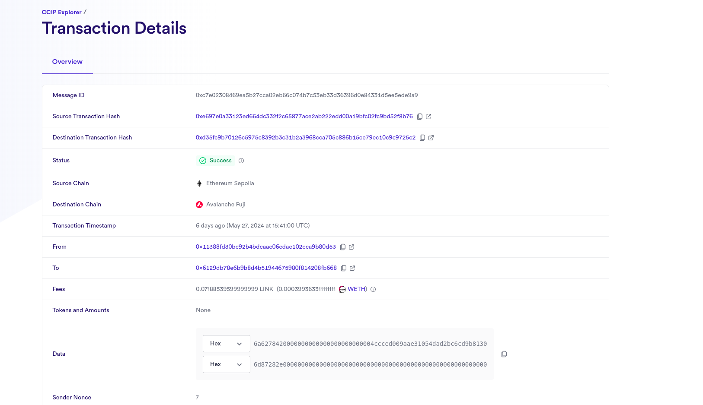

# CCIP MintFlow

# What CCIP MintFlow Does

CCIP MintFlow is a revolutionary solution aimed at solving key issues in the blockchain ecosystem, enhancing interoperability and efficiency in cross-chain transactions.

### The blockchain landscape faces several challenges:

#### Cross-Chain Token Transfer Challenges:

Inefficient and complex token transfers between different blockchains.

#### Requirement of Bridges:

Resource-intensive and time-consuming bridges required for each blockchain pair.

#### No Cross-Chain NFT Transfer:

Restriction of NFT transfers within the same blockchain, limiting flexibility.

# Features

#### Cross-Chain Escrow Services:

Secure escrow deposits by both parties.
Tokens transferred to the specified blockchain as per user instructions.

#### AI-Enabled Cross-Chain Transfers:

AI technology for secure and efficient token transfers across different chains.
Integration with escrow service for smooth and reliable transactions.

#### Cross-Chain NFT Minting:

Mint NFTs directly onto the specified blockchain network.
Enhances flexibility and reach of NFTs across various chains.

# Blockexplorer Image

